# A07 MessagIST Project Read Me

## Team

| Number | Name            | User                                 | E-mail                                            |
| ------ | --------------- | ------------------------------------ | ------------------------------------------------- |
| 112191 | Xiting Wang     | <https://github.com/OperandOverflow> | <mailto:xiting.wang@tecnico.ulisboa.pt>           |
| 112269 | Laura Cunha     | <https://github.com/kuukitenshi>     | <mailto:laura.r.velasco.cunha@tecnico.ulisboa.pt> |
| 112270 | Rodrigo Correia | <https://github.com/mkuritsu>        | <mailto:rodrigo.a.c.correia@tecnico.ulisboa.pt>   |

   

## Contents

This repository contains documentation and source code for the *Network and Computer Security (SIRS)* project.

The [REPORT](REPORT.pdf) document provides a detailed overview of the key technical decisions and various components of the implemented project.
It offers insights into the rationale behind these choices, the project's architecture, and the impact of these decisions on the overall functionality and performance of the system.

This document presents installation and demonstration instructions.


<!-- --------------------------------------------------------------------------- -->
## Installation

To see the project in action, it is necessary to setup a virtual environment, with 2 networks and 4 machines.  

The following diagram shows the environment topology:

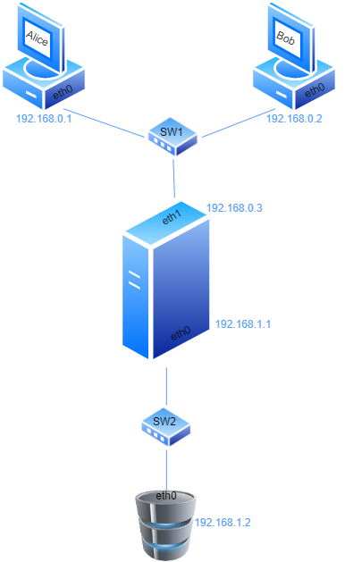


### Prerequisites

All the virtual machines are based on: Linux 64-bit, Kali 2024.4

[Download](https://www.kali.org/get-kali/#kali-installer-images) and [install](https://github.com/tecnico-sec/Setup) a virtual machine of Kali Linux 2024.4.  
Clone the base machine to create the other machines.


### Machine configurations

On a base machine use Git to obtain a copy of all the scripts and code.
```sh
$ git clone https://github.com/tecnico-sec/a07-messagIST.git
```
On the directory `setup_scripts` there is an initialization script with the machine name, with prefix `init-` and suffix `.sh`, that installs all the necessary packages and makes all required configurations in the a clean machine.

There's also a `pre-init` that should be runned from this directory on the base machine to download the project dependencies on the Kali repositories.

Afterward, create a **linked clone** for each machine listed in the network diagram above.
For each of these machines, configure the **network adapters** according to the diagram by following these steps:

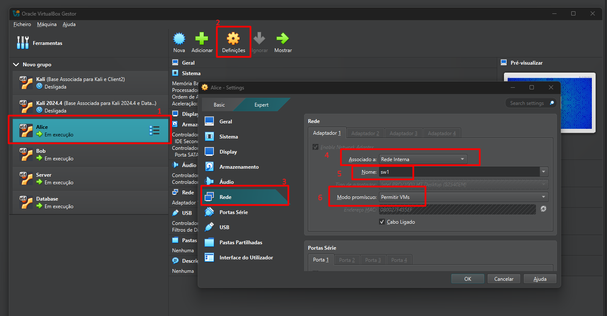

Next we have custom instructions for each machine.

---
#### Machine Client 1: Alice

This machine runs our TUI client application in Rust 1.83.

To setup run this command on the `setup_scripts` directory:

```sh
$ ./init-alice.sh
```

The expected result is that you should have an executable file named `client` in the `./target/debug` directory.

Now, run the executable file, and in the UI field that asks for the server IP, insert `192.168.0.3:8000`.

<!-- // -------------------------------------------- -->
---
#### Machine Client 2: Bob

This machine runs our TUI client application in Rust 1.83.

To setup run this command on the `setup_scripts` directory:

```sh
$ ./init-bob.sh
```

The expected result is that you should have an executable file named `client` in the `./target/debug` directory.

Now, run the executable file, and in the UI field that asks for the server IP, insert `192.168.0.3:8000`.

<!-- // -------------------------------------------- -->
---
#### Machine Server

This machine runs our server application in Rust 1.83.

To setup run this command on the `setup_scripts` directory:

```sh
$ ./init-server.sh
```

The expected result is that you should have an executable file named `server` in the `./target/debug` directory.

Once you have the executable ready to run, execute the following command. It contains the necessary flags to **connect to the database** using its IP address and password:
```sh
$ PGHOST=192.168.1.2 PGPASSWORD=2Rk4M4LQGbrZB2j ./server
```


<!-- // -------------------------------------------- -->
---
#### Machine Database

This machine runs a database server with [PostgreSQL 17.2](https://www.postgresql.org)

To setup run this command on the `setup_scripts` directory:
```sh
$ sudo ./init-database.sh
```

To test:
```sh
$ systemctl status postgresql
```

After the setup and then the test command you should see something like the following print that shows the database PostgreSQL service running.


<!-- --------------------------------------------------------------------------- -->
## Demonstration

Now with all the machines running you can make use of all the features that our application provides, such as:
- Register


- Login
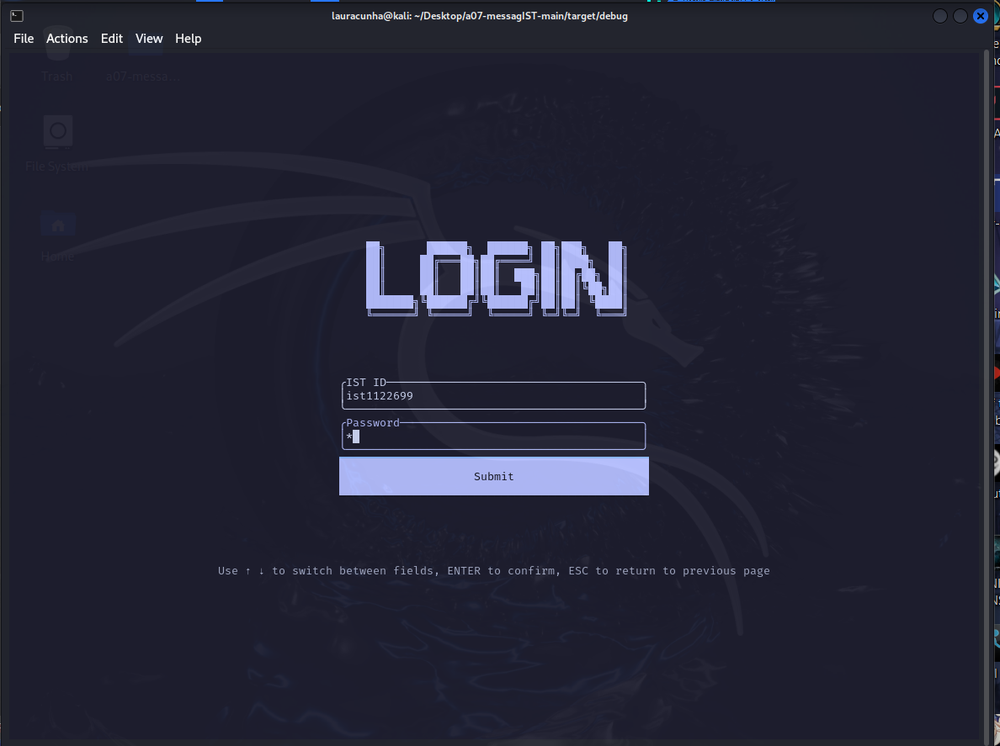

- Add a contact by searching the id or manually using the receiver's public key
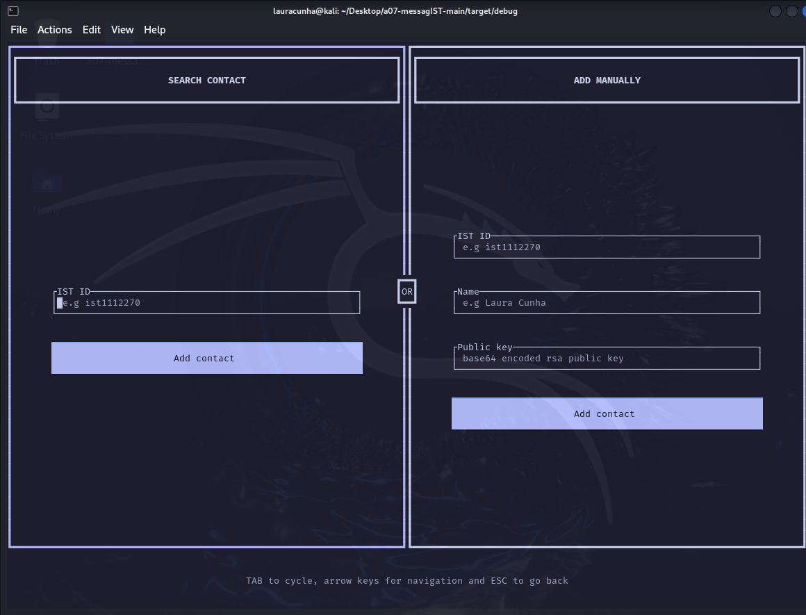

- See a contact
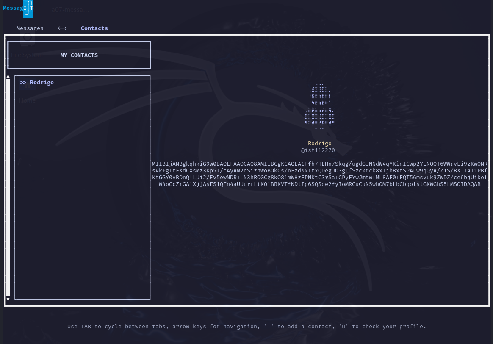

- See the own profile
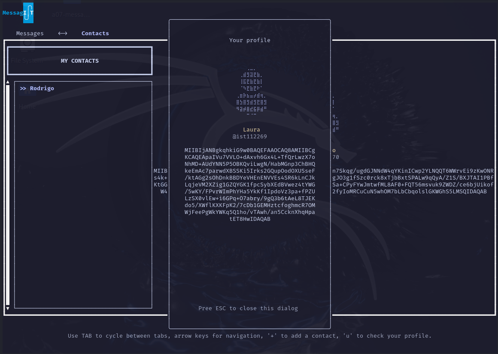

- Chat with friends
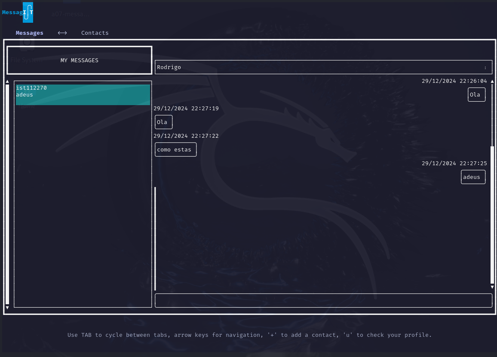

---

Now to run the **demo**, once all the networks and machines are up and running, on Bob's machine, turn off the TUI Bob client and run the `test_client` executable located in the `./target/debug directory` using the following command:

```sh
$ ./test-client 192.168.0.3:8000
```
This client emulates potential attacks such as **out-of-order** messages, **missing** messages, and **tampered** messages.

It is important to note that by pressing `F10` on the client UI, you can access the client **logs** as shown in the following image:

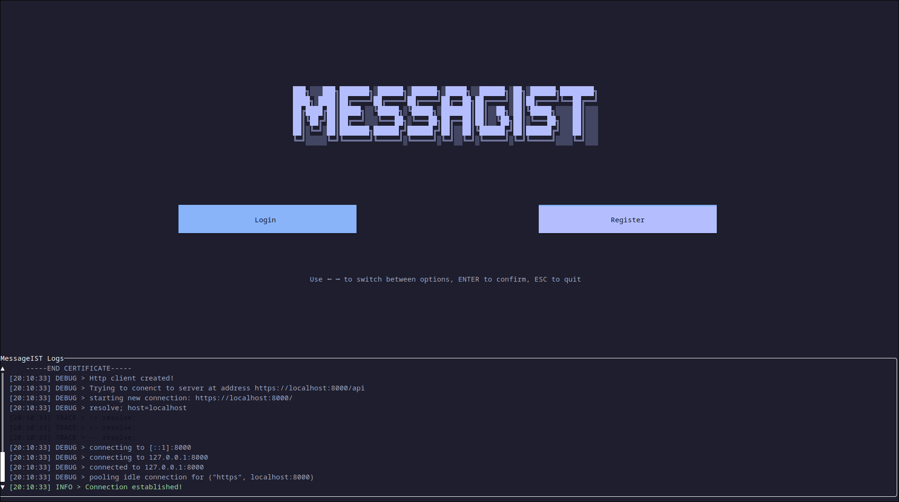

As you perform operations on the UI, these logs display the message **payloads** containing encrypted data, relevant **messages** about system operations, and warnings about detected **attacks**, including those performed by the test client.


Additionally, the following screenshots shows:
- The **hashes of the passwords** on the database
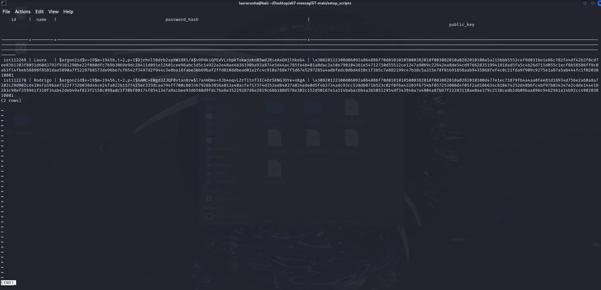

- The **TLS** connections between the server and the clients, and the server and the database, as well as the encrypted payloads, are visible on the hex editor on **Wireshark**.
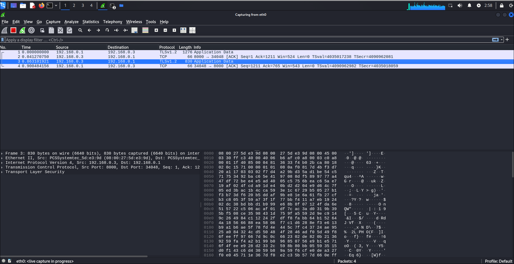
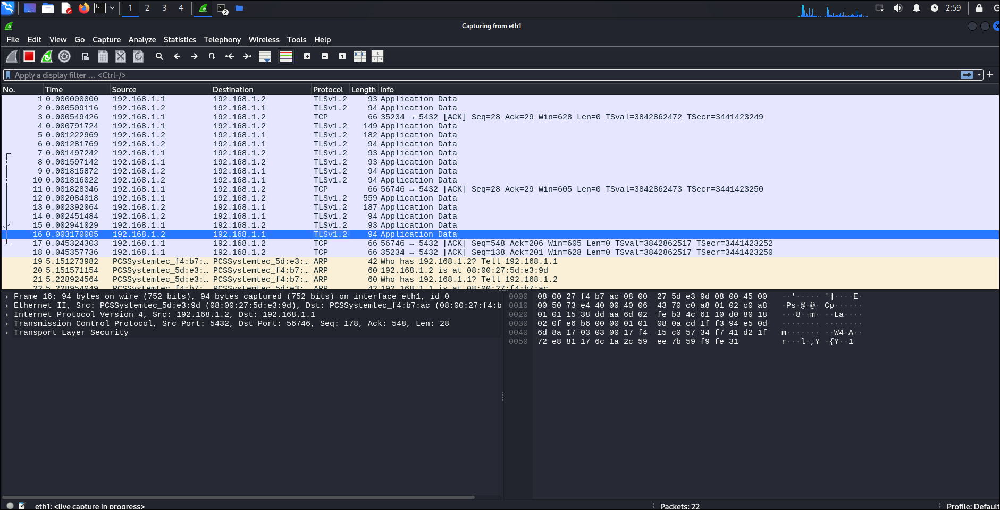

- The **encrypted** file of the local **database**
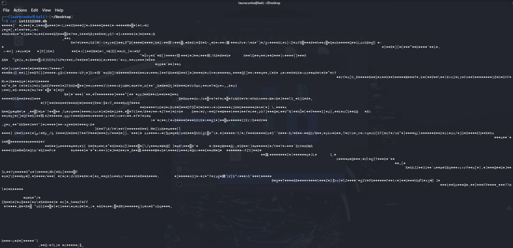


<!-- --------------------------------------------------------------------------- -->
## Additional Information

### Links to Used Tools and Libraries
- [Rust 1.83](https://www.rust-lang.org)
- [PostgreSQL 17.2](https://www.postgresql.org)
- [KALI 2024.4](https://www.kali.org)
- [SQLite](https://www.sqlite.org)
- [SQLCipher](https://www.zetetic.net/sqlcipher/)
- [SSL/TLS](https://docs.rs/native-tls/latest/native_tls/)
- [WebSocket](https://docs.rs/reqwest-websocket/latest/reqwest_websocket/)
- [Ratatui](https://ratatui.rs)
- [Rocket](https://rocket.rs)
- [OpenSSL](https://www.openssl.org)
- [Reqwest](https://docs.rs/reqwest/latest/reqwest/)
- [iptables](https://linux.die.net/man/8/iptables)
- [Rust Crypto](https://github.com/rustcrypto)

### Versioning
We use [SemVer](http://semver.org/) for versioning.  

### License
This project is licensed under the MIT License - see the [LICENSE.txt](LICENSE.txt) for details.
